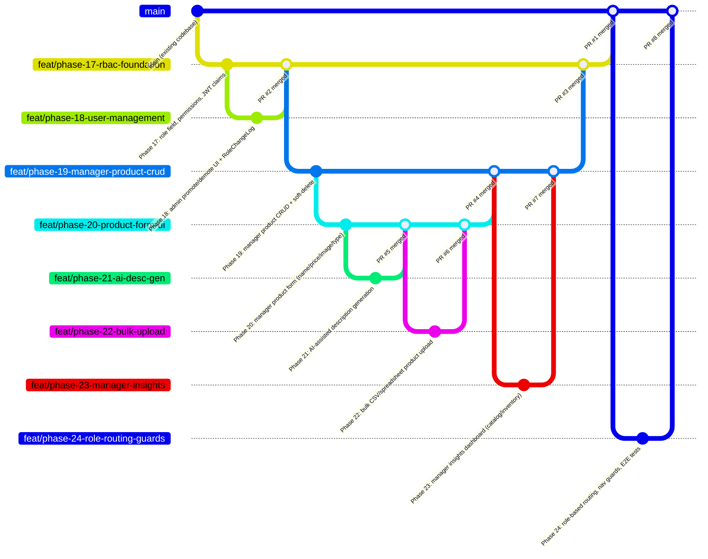

# LILLA — Multi-Role Access System (Customer / Manager / Admin) Tasksheet

This tasksheet describes the implementation of role-based access control (RBAC) on top of LILLA's existing single-tier `IsAdminUser` system. It introduces a **Manager** role between Customer and Admin, with scoped product-management and inventory-insight capabilities. Phases continue the numbering from the repo's existing `tasksheet.md` (currently through Phase 13), starting at **Phase 17** per request.

Each phase is self-contained and can be handed to an agent independently, but **Phase 17 must be completed first** since every later phase depends on the role field and permission classes it introduces.

---

## 🧭 Role Model Decision (read before starting)

- **Roles are modeled as an explicit field**, not inferred from `is_staff`/`is_superuser`. Add `role` to the User model with values `customer`, `manager`, `admin`. Default `customer`.
- Both `manager` and `admin` keep `is_staff=True` so Django's built-in `/admin/` panel remains accessible as a fallback/debug tool, but **all application-level permission checks branch on `role`**, never on `is_staff` alone.
- `is_superuser` is reserved for true Django superusers (initial seed/CLI-created accounts only) and is not exposed or settable via any API.
- Only existing Admins can create or promote a user to Manager, via the dashboard built in Phase 18. There is no self-registration path for Manager/Admin.
- New products created by a Manager go live immediately (no approval queue). Product **deletion** requires Admin confirmation — Manager-initiated deletes are soft (status flips to `pending_deletion`), Admin approves to finalize.
- Manager's analytics are scoped to **catalog/inventory** data only (stock levels, low-stock alerts, product counts, review/rating summaries). Manager has **no access** to `/api/admin/analytics/` revenue, order totals, or payment data — that stays Admin-only.

---

## Phase 17: Role Field, Permissions Backbone & Migration

**Goal**: Establish the `role` field, DRF permission classes, and JWT claims that every subsequent phase depends on. No user-facing UI yet — this is the foundation layer.

**Tasks**:

- **[Backend]** Add `role` field to the User model (`backend/api/models.py`) as a `CharField` with `choices=[("customer", "Customer"), ("manager", "Manager"), ("admin", "Admin")]`, `default="customer"`, `db_index=True`.
- **[Backend]** Generate and run the migration. Write a data migration that backfills `role="admin"` for all existing users where `is_superuser=True` or `is_staff=True`, so no current admin loses access.
- **[Backend]** Create `backend/api/permissions.py` (if not already present) with three DRF permission classes:
  - `IsAdminRole` — `request.user.role == "admin"`
  - `IsManagerOrAdminRole` — `request.user.role in ("manager", "admin")`
  - `IsAdminRoleForDestroy` — allows `manager` and `admin` for safe methods and create/update, but restricts `DELETE` to `admin` only (used on the product viewset in Phase 19).
- **[Backend]** Update the JWT token serializer (wherever SimpleJWT's `TokenObtainPairSerializer` is customized for the OTP flow) to embed `role` as a custom claim in the access token payload, so the frontend can read role without an extra API call after login.
- **[Backend]** Update `GET /api/auth/profile/` response serializer to include `role` in the payload.
- **[Backend]** Add a `role` filter/column to the Django admin panel's User list display for visibility.
- **[Frontend]** Update the JWT/user type definitions (`lib/types.ts` or equivalent) to include `role: "customer" | "manager" | "admin"`.
- **[Frontend]** Update the auth store/hook (Zustand auth slice or wherever decoded JWT/profile is held) to expose `role` and derived booleans (`isAdmin`, `isManager`, `isManagerOrAdmin`) for use in route guards and conditional rendering.
- **[Tests]** `test_admin.py` (or a new `test_roles.py`): verify role defaults to `customer` on signup, verify migration backfill logic, verify each permission class against all three roles for allow/deny.

**Acceptance criteria**: Existing Admin functionality is fully unaffected (regression-test the existing `/api/admin/*` endpoints). New users default to `customer`. JWT payload contains `role`.

---

## Phase 18: Admin User Management — Promote/Demote to Manager

**Goal**: Give Admins a dashboard page to view all users and change roles, so Manager accounts can be created without touching the Django admin panel directly.

**Tasks**:

- **[Backend]** Extend the existing `GET /api/admin/users/` endpoint (already listed in the repo's API table) to support `?role=manager` filtering and to include each user's current `role`, `date_joined`, and `last_login` in the response.
- **[Backend]** Add `PATCH /api/admin/users/<id>/role/` — `IsAdminRole`-gated endpoint accepting `{ "role": "manager" | "admin" | "customer" }`. Validate the requesting user isn't demoting themselves out of their only Admin account (add a guard: block if this is the last remaining `admin`-role user). Log every role change to a new lightweight `RoleChangeLog` model (`changed_by`, `target_user`, `old_role`, `new_role`, `timestamp`) for auditability, mirroring the existing `StockAdjustment` audit-trail pattern.
- **[Backend]** Migration for `RoleChangeLog` model; register it in `admin.py`.
- **[Frontend]** Build `/admin/users` page: a searchable/sortable table (name, email, role badge, joined date, last login) with a role-change dropdown per row, gated behind the existing Admin route guard.
- **[Frontend]** Confirmation modal on role change ("Promote Jane Doe to Manager?") before the PATCH fires.
- **[Tests]** `test_admin.py`: permission checks (Manager cannot call this endpoint, Customer cannot), last-admin guard, audit log creation on every change.

**Acceptance criteria**: An Admin can find any user and promote them to Manager or demote a Manager back to Customer, with an audit trail and no way to accidentally lock all Admins out.

---

## Phase 19: Manager Product Management — Backend CRUD + Soft-Delete Workflow

**Goal**: Build the API surface for Managers to create, edit, and request deletion of products, reusing the existing `Product` model and revalidation signals.

**Tasks**:

- **[Backend]** Add `deletion_status` field to the `Product` model: `CharField` choices `("active", "pending_deletion", "archived")`, default `"active"`. (Keeps the existing `is_active`/stock fields untouched — this is purely about the deletion approval flow.)
- **[Backend]** Update `ProductViewSet` permission_classes to use `IsAdminRoleForDestroy` (from Phase 17) instead of the current `IsAdminUser`, so both Manager and Admin can `POST`/`PUT`/`PATCH`, but only Admin can hit `DELETE` directly.
- **[Backend]** Override the viewset's `destroy()` behavior for Manager-initiated requests: instead of deleting, a Manager hitting `DELETE` sets `deletion_status="pending_deletion"` and returns `202 Accepted`. Admin hitting `DELETE` on a `pending_deletion` (or any) product performs the real delete (or sets `deletion_status="archived"` if you prefer reversible archiving over hard delete — recommend archiving, since Order history references Product and a hard delete would break order line-item display).
- **[Backend]** Add `POST /api/admin/products/<id>/approve-deletion/` (Admin-only) and `POST /api/admin/products/<id>/reject-deletion/` (Admin-only, flips back to `active`) endpoints.
- **[Backend]** Ensure product create/update from Manager still fires the existing post-save ISR revalidation signal (`signals.py`) so storefront pages stay in sync — no change needed here if the signal is model-level, just confirm it fires for Manager-authored saves too.
- **[Backend]** Update `StockAdjustment` audit logging (already exists per the repo) to also log `created_by`/`updated_by` user + role on product create/update, not just stock-level edits.
- **[Tests]** New `test_manager_products.py`: Manager can create/update products; Manager `DELETE` produces `pending_deletion` not actual deletion; Customer is forbidden from all of the above; Admin can approve/reject deletion; archived products are excluded from public `/api/products/` list but retained for historical order lookups.

**Acceptance criteria**: Manager can fully manage product lifecycle except final deletion. No product referenced by an existing Order can ever be hard-deleted — only archived.

---

## Phase 20: Manager Product Form — Single Product CRUD UI (Name, Price, Image, Description, Type)

**Goal**: The core "automated page" — a clean, fast form for adding/editing one product at a time, with both image-URL and file-upload support.

**Tasks**:

- **[Backend]** Add an `ImageField` upload path alongside the existing image URL field on `Product` (or confirm current schema — repo's `models.py` likely already has an image reference for seeded products; extend it to accept an uploaded file via `MultipartParser`/`FormParser` on the viewset, falling back to URL string if no file is sent). Store uploads under `MEDIA_ROOT/products/`; document the env var seam (`MEDIA_URL`) for swapping to S3/Cloudinary later without code changes to the serializer.
- **[Backend]** Confirm/extend the `type` field (likely maps to existing `category`/`concern` relations) — expose available categories and concerns via the existing `/api/categories/` endpoint so the frontend form can populate a dropdown rather than free text.
- **[Frontend]** Build `/manager/products/new` and `/manager/products/[id]/edit` pages with fields: Name, Price (currency-aware, validate against existing multi-currency base-USD storage pattern), Image (tabbed input: "Paste URL" / "Upload File" with drag-and-drop and a live preview thumbnail), Description (plain textarea — AI assist comes in Phase 21), Type (category/concern dropdown sourced from `/api/categories/`).
- **[Frontend]** Client-side validation (required fields, price > 0, image file size/type limits e.g. max 5MB, jpg/png/webp only) before submission, with inline error states matching the existing form patterns used in the Address CRUD modals (Phase 13).
- **[Frontend]** Success toast + redirect to `/manager/products` list view on save; the list view shows all products with status badges (`active`, `pending_deletion`) and Edit/Request-Delete actions.
- **[Frontend]** Route guard: `/manager/*` pages accessible to `role === "manager"` and `role === "admin"` (Admin should be able to use the same simple form too, not just the full admin panel).
- **[Tests]** Playwright E2E: Manager logs in, creates a product via URL image, creates another via file upload, edits one, requests deletion of one, confirms it disappears from the public storefront but Admin still sees it as `pending_deletion`.

**Acceptance criteria**: A Manager with zero technical knowledge can add a fully-formed, live product in under a minute, using either an image link or their own photo.

---

## Phase 21: AI-Assisted Product Description Generation

**Goal**: Let the Manager generate a polished product description from just the name + type (+ optional keywords), calling the Anthropic API server-side.

**Tasks**:

- **[Backend]** Add `anthropic` to `backend/requirements.txt`. Add `ANTHROPIC_API_KEY` to `backend/.env.example` (never logged, never exposed to any serializer response).
- **[Backend]** New endpoint `POST /api/manager/products/generate-description/` (`IsManagerOrAdminRole`-gated) accepting `{ name, type, concern?, keywords? }`. Server builds a prompt instructing the model to write a concise, on-brand cosmetic/skincare product description (2–4 sentences, premium tone matching LILLA's existing copy style) and calls `client.messages.create()` with a small `max_tokens` (e.g. 300) using the standard `claude-sonnet-4-6` model string used elsewhere in this environment, or whichever current model the backend's own provider config specifies — **do not hardcode a model the agent can't verify is still current; read it from an env var `ANTHROPIC_MODEL` with a sensible default.**
- **[Backend]** Rate-limit this endpoint reusing the existing custom DRF throttle pattern (`throttling.py`) — e.g. 10 generations/minute per user — to control API cost and prevent abuse.
- **[Backend]** Sanitize/validate the returned text (length cap, strip any markdown the model might add) before sending to the frontend; never persist the AI draft directly to the Product until the Manager explicitly saves the form.
- **[Frontend]** Add a "✨ Generate with AI" button next to the Description field in the product form (Phase 20). On click, sends current Name/Type/Concern values, shows a loading state, populates the textarea with the result, and lets the Manager edit freely before saving — never auto-submits.
- **[Frontend]** Show a small "Regenerate" option and a character/word count, and handle failure gracefully (API down, rate-limited) with a clear inline message rather than blocking form submission — the Manager must always be able to type a description manually.
- **[Tests]** Backend: mock the Anthropic client in tests, verify throttle behavior, verify permission gating (Customer forbidden), verify graceful handling of API errors (5xx passthrough avoided, sanitized error returned).

**Acceptance criteria**: Generation is fast, optional, editable, cost-controlled, and never silently writes to the database.

---

## Phase 22: Bulk Product Upload (CSV / Spreadsheet)

**Goal**: Let a Manager add many products at once via a spreadsheet, for catalog migrations or seasonal drops.

**Tasks**:

- **[Backend]** New endpoint `POST /api/manager/products/bulk-upload/` (`IsManagerOrAdminRole`-gated) accepting a CSV/XLSX file with columns: `name, price, description, type, concern, image_url, stock`. Parse server-side (reuse `openpyxl`/`csv` — check `requirements.txt` for what's already available), validate every row before committing any (transactional — either all valid rows are created or none are, using the same `@transaction.atomic` pattern already used for checkout), and return a row-by-row result report (`{row: 2, status: "created", product_id: 41}` / `{row: 5, status: "error", reason: "price must be > 0"}`).
- **[Backend]** Cap upload size (e.g. 500 rows / 5MB) and reuse the existing throttle infrastructure to prevent abuse.
- **[Backend]** Image handling for bulk rows: `image_url` column only (no bulk file upload of binary images in this phase — keep scope sane); validate URL format but don't fetch/verify reachability synchronously.
- **[Frontend]** `/manager/products/bulk-upload` page: file picker, a downloadable CSV template button (pre-filled with the correct headers and one example row), an upload button, and a results table after processing showing per-row success/failure with reasons, plus a summary count ("38 created, 2 failed").
- **[Frontend]** Link this page from the `/manager/products` list view ("Bulk Upload" button next to "Add Product").
- **[Tests]** Backend: valid file creates all rows; one invalid row fails the whole batch (atomic) and returns clear per-row errors; oversized file rejected; Customer/unauthenticated requests forbidden.

**Acceptance criteria**: A Manager can upload a 50-row spreadsheet and get unambiguous feedback on exactly what succeeded or failed and why, with no partial/corrupt catalog state on failure.

---

## Phase 23: Manager Insights Dashboard (Catalog & Inventory Only)

**Goal**: Give Managers visibility into product/inventory health without exposing revenue or order financials, which stay Admin-only.

**Tasks**:

- **[Backend]** New endpoint `GET /api/manager/insights/` (`IsManagerOrAdminRole`-gated) returning catalog-scoped aggregates only:
  - Total active products, total `pending_deletion` count, total archived count
  - Low-stock alerts (products below a configurable threshold, e.g. `stock < 10`) — reuse the existing `StockAdjustment` model for "recently adjusted" history
  - Top-rated and lowest-rated products (using the existing `Review` aggregate rating fields — no need to recompute, just query)
  - Products with zero reviews (visibility gap flag)
  - Category/concern distribution counts (how many products per category) to spot catalog imbalance
  - **Explicitly excluded**: order counts, revenue, payment status, customer PII — this endpoint must never join against the `Order` or `Payment`-adjacent models.
- **[Backend]** Keep this endpoint's queryset fully separate from `/api/admin/analytics/` (don't refactor that view to "add a role check" — write a new view so financial data can never leak into the Manager-facing serializer by accident).
- **[Frontend]** Build `/manager/dashboard` with cards/charts (reuse whatever charting approach the existing `/admin` analytics dashboard uses, e.g. Recharts) for: stock health, rating distribution, catalog composition by category, and a "needs attention" list (low stock + zero-review products) with direct links into the edit form from Phase 20.
- **[Frontend]** Make this the default landing page after Manager login (route `/manager` redirects to `/manager/dashboard`), mirroring how `/admin` is the Admin landing page.
- **[Tests]** Backend: verify response shape never includes any revenue/order field even if the model is later extended (a "field allowlist" test, not just "endpoint returns 200"); permission test confirms Customer is forbidden and that this endpoint's queryset count matches manual DB assertions in a seeded test scenario.

**Acceptance criteria**: Manager gets genuinely useful, actionable catalog insight; a financial-data leak via this endpoint is structurally prevented, not just policy-prevented.

---

## Phase 24: Frontend Role-Based Routing, Navigation & Guards

**Goal**: Tie every prior phase together into a coherent multi-role frontend experience with proper guards, redirects, and nav.

**Tasks**:

- **[Frontend]** Centralize role-guard logic in a single `withRoleGuard(allowedRoles)` HOC or middleware check (Next.js middleware reading the JWT claim from Phase 17), applied consistently to `/admin/*` (admin only), `/manager/*` (manager + admin), and leave all existing customer-facing routes untouched.
- **[Frontend]** Unauthorized access (e.g. a Customer manually navigating to `/manager/dashboard`) redirects to `/` with a toast, not a blank/error page.
- **[Frontend]** Update the main Navbar/account dropdown: Customers see the existing menu unchanged; Managers see an added "Manager Dashboard" link; Admins see both "Manager Dashboard" and "Admin Panel" links (Admin should have full access to the simpler Manager tools too, not be forced through the heavier Admin-only views for routine product edits).
- **[Frontend]** Add a small role badge next to the user's name in the account menu ("Manager" / "Admin") so multi-role testers always know which account they're in.
- **[Tests]** Playwright E2E covering all three roles: Customer cannot reach `/manager` or `/admin` routes (redirected), Manager can reach `/manager/*` but not `/admin/*`, Admin can reach everything.

**Acceptance criteria**: No route leaks across roles; navigation clearly reflects what each logged-in role can do; this phase is the integration test for Phases 17–23.

---

## 📋 Summary Table

| Phase | Focus | Depends On |
|---|---|---|
| 17 | Role field, permissions, JWT claims | — |
| 18 | Admin: promote/demote users to Manager | 17 |
| 19 | Manager product CRUD backend + soft-delete approval flow | 17 |
| 20 | Manager product form UI (name/price/image/description/type) | 17, 19 |
| 21 | AI-generated product descriptions | 20 |
| 22 | Bulk CSV/spreadsheet product upload | 19, 20 |
| 23 | Manager insights dashboard (catalog/inventory only) | 17, 19 |
| 24 | Role-based routing, nav, and end-to-end guard testing | 17–23 |

---

## Notes for the Implementing Agent

- Read `backend/api/models.py`, `views.py`, `permissions.py` (if present), and `serializers.py` in full before starting Phase 17 — the exact current shape of the User and Product models will determine field names; this tasksheet describes intent, not literal diffs.
- Do not modify `/api/admin/analytics/` to "just add a role check" for Manager access — Phase 23 explicitly requires a separate endpoint so financial data is structurally unreachable by Manager, not just permission-gated.
- Preserve all existing Admin capabilities throughout — Admin is a superset of Manager, never a different, narrower path.
- Every new Manager-facing page should reuse existing design tokens/components (Shadcn/ui, Framer Motion patterns) already established in the Admin dashboard and Account dashboard for visual consistency — do not introduce a new design language for Manager-only pages.
- Run the full existing test suite (`python backend/manage.py test api`) after each phase to confirm no regression in OTP, checkout, review, or analytics behavior before moving to the next phase.

---

## 🔀 Git Branching Topology & PR Workflow

### Rules

- **Every phase = one branch = one Pull Request**. No phase may be squashed into another phase's PR.
- Each branch is cut from its **direct parent branch** (the phase it depends on), not from `main` — this keeps PRs small and reviewable in isolation.
- A phase branch may only be merged into its parent once:
  1. All its own tests pass (`python backend/manage.py test api` + `npm run test:unit`).
  2. The PR has been reviewed and approved.
- `main` is the final integration point. Only Phase 17 (the root) and Phase 24 (the leaf integrator) merge directly to `main`; all intermediate phases flow upward through the chain.
- Branch naming convention: `feat/phase-<number>-<short-slug>` (e.g. `feat/phase-17-rbac-foundation`).
- PR title convention: `[Phase <N>] <one-line description>` (e.g. `[Phase 19] Manager product CRUD backend + soft-delete flow`).

### Branch Topology

```
main
└── feat/phase-17-rbac-foundation          ← PR #1 → main
    ├── feat/phase-18-user-management      ← PR #2 → feat/phase-17-rbac-foundation
    └── feat/phase-19-manager-product-crud ← PR #3 → feat/phase-17-rbac-foundation
        ├── feat/phase-20-product-form-ui  ← PR #4 → feat/phase-19-manager-product-crud
        │   ├── feat/phase-21-ai-desc-gen  ← PR #5 → feat/phase-20-product-form-ui
        │   └── feat/phase-22-bulk-upload  ← PR #6 → feat/phase-20-product-form-ui
        └── feat/phase-23-manager-insights ← PR #7 → feat/phase-19-manager-product-crud
feat/phase-24-role-routing-guards          ← PR #8 → main (after 17–23 all merged)
```

### Mermaid Diagram



### PR Checklist Template

Each PR description must include:

```markdown
## Phase <N> — <Title>

### Summary
<!-- One paragraph of what this PR does -->

### Depends On
<!-- PR number(s) of parent branch, or "none" for Phase 17 -->

### Backend Changes
- [ ] Model/migration changes (if any)
- [ ] New/updated endpoints
- [ ] Permission classes applied
- [ ] Tests written and passing (`python backend/manage.py test api`)

### Frontend Changes
- [ ] Pages/components added
- [ ] Route guard applied
- [ ] Zustand store/types updated (if any)

### Test Results
<!-- Paste output of `python backend/manage.py test api` -->
<!-- Paste output of `npm run test:unit` -->

### Regression Check
- [ ] `python backend/manage.py test api` — all pre-existing tests still pass
- [ ] No new lint errors
```
